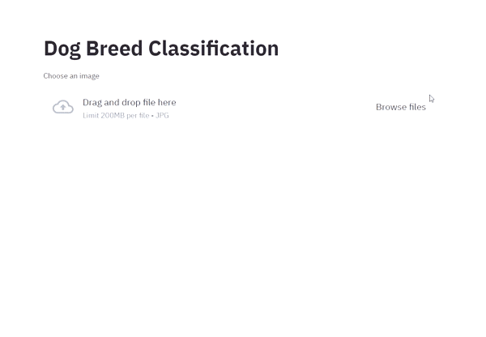

# Dog breed classification

## Description

This project allows to classify 120 different dog breeds. 

I used transfer learning for image classification, pre-trained model from tensorhub - mobilenetv2

Deployed model to web using Streamlit

## Demo 

----------------------------------------------------------------------------------

## License
[MIT](https://choosealicense.com/licenses/mit/)
